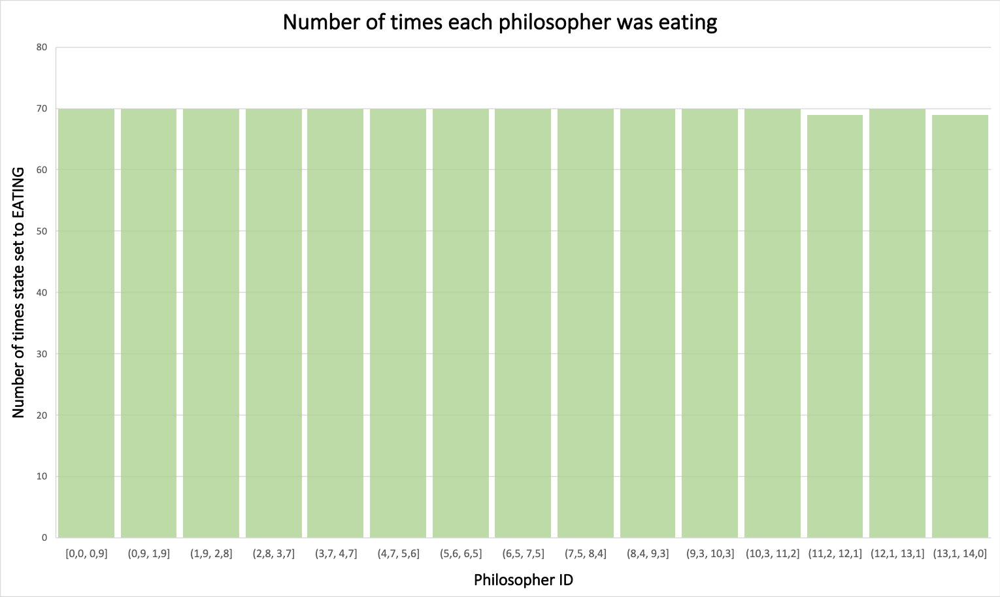

# Dining Philosophers Problem

## Problem description

1. There are N philosophers
2. There are N chopsticks
3. Philosophers either eat or think
4. Every philosopher needs two chopsticks to eat - left and right
5. A philosopher can only eat if their neighbors are not eating

## Potential issues and constraints

### Deadlock

If every philosopher were to pick up the left chopstick first, then all
philosophers would be waiting for the right chopstick.

`Prevention`: a philosopher should pick up both chopsticks as a single
operation.

### Starvation

Starvation occurs when a philosopher is continuously waiting for their neighbors
to finish eating, potentially never getting a chance to eat themselves.

`Prevention`: a fairness policy.

## Solution

There are 3 states a philosopher can be in:

1. THINKING
2. HUNGRY
3. EATING

Life cycle of a philosopher: THINKING -> HUNGRY -> EATING -> repeat

We need to implement the following functions:

1. `test`: _checks if a philosopher can start eating_
   - returns true if neighbors are not eating
   - implements a fairness policy
2. `pickUpChopsticks`: _start of eating_
   - acquires a mutex before a philosopher attempts to eat and sets their state
     to HUNGRY
   - waits for the `test` function
   - sets the philosopher's state to EATING and releases the mutex
3. `putDownChopsticks`: _signals that a philosopher has finished eating_
   - sets the philosopher's state to THINKING
   - notifies the neighbors
4. `philosopherThread`: _implements the life cycle of a philosopher_
   - `think` _(sleep)_
   - `pickUpChopsticks`
   - `eat` _(sleep)_
   - `putDownChopsticks`
   - _**repeat**_

## Results

